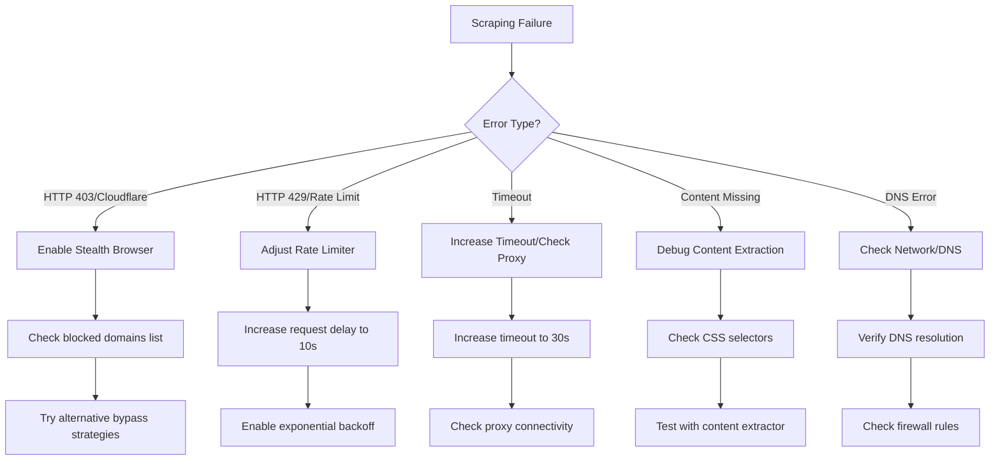

# Scraping Failures Runbook

This runbook provides troubleshooting procedures for common scraping failures.

---

## Troubleshooting Flowchart



---

## Common Error Codes

### HTTP 403 - Forbidden

**Cause**: Anti-bot protection detected (Cloudflare, etc.)

**Resolution**:
1. Check if domain is in blocked list:
   ```python
   from src.bypass.anti_bot import AntiBotBypass
   bypass = AntiBotBypass()
   print(bypass.is_domain_blocked("example.com"))
   ```

2. Try alternative bypass strategies:
   ```bash
   # Check bypass strategies
   python -c "from src.bypass.anti_bot import AntiBotBypass; print(AntiBotBypass())"
   ```

3. Add domain to blocked list if persistently failing:
   ```python
   # In src/bypass/anti_bot.py
   self._blocked_domains.add("problem-domain.com")
   ```

---

### HTTP 429 - Rate Limited

**Cause**: Too many requests to source

**Resolution**:
1. Check current delay settings:
   ```python
   from src.bypass.anti_bot import AntiBotBypass
   bypass = AntiBotBypass()
   print(f"Request delay: {bypass._request_delay}s")
   ```

2. Increase request delay:
   ```python
   bypass._request_delay = 10  # Increase to 10 seconds
   ```

3. Check exponential backoff:
   ```python
   delay = bypass.get_delay_for_domain("https://example.com")
   print(f"Current delay with backoff: {delay}s")
   ```

---

### Timeout Errors

**Cause**: Source too slow or network issues

**Resolution**:
1. Check network connectivity:
   ```bash
   python -m src.operations.diagnostic_toolkit --check api
   ```

2. Increase timeout in aiohttp requests:
   ```python
   timeout = aiohttp.ClientTimeout(total=30)  # Increase from default
   ```

3. Check if source is accessible:
   ```bash
   curl -I https://example.com
   ```

---

### Content Missing / Empty Results

**Cause**: CSS selector changes, dynamic content, or paywall

**Resolution**:
1. Test content extraction:
   ```python
   from src.content_extractor import ContentExtractor
   extractor = ContentExtractor()
   content = extractor.extract("https://example.com/article")
   print(f"Content length: {len(content)}")
   ```

2. Check for paywall detection:
   ```python
   from src.bypass.anti_bot import AntiBotBypass
   bypass = AntiBotBypass()
   is_blocked = bypass.is_blocked_sync(html_content)
   ```

3. Try bypass strategies:
   ```python
   content, strategy = await bypass.smart_fetch_with_fallback(url)
   print(f"Used strategy: {strategy}")
   ```

---

## Per-Source Troubleshooting

### Medium.com
- Uses Cloudflare protection
- Requires stealth browser for full content
- Has aggressive rate limiting

**Solution**: Use DOM manipulation bypass, 10s+ delay

### TechCrunch
- Standard anti-bot measures
- Referer spoof usually works

**Solution**: Add Google referer header

### Substack
- Soft paywalls for subscriber content
- Archive.org fallback often works

**Solution**: Try Wayback Machine bypass

### Analytics India Mag
- Aggressive blocking, often fails all bypasses

**Solution**: Add to blocked domains list

---

## Monitoring Scraping Health

### Check Success Rates

```bash
# Via diagnostic toolkit
python -m src.operations.diagnostic_toolkit --check scraping

# Via API endpoint
curl http://localhost:8000/metrics | grep scrape
```

### View Recent Failures

```python
from src.engine.scrape_queue import get_scrape_queue
queue = get_scrape_queue()
stats = queue.get_statistics()

print(f"Success rate: {stats['success_rate']}%")
print(f"Failed: {stats['failed']}")
```

### Check Per-Domain Stats

```python
by_domain = stats.get("by_domain", {})
for domain, domain_stats in by_domain.items():
    if domain_stats['failed'] > 0:
        print(f"{domain}: {domain_stats['failed']} failures")
```

---

## Emergency Procedures

### Complete Scraping Outage

1. **Stop all scraping immediately**
2. **Check diagnostics**: `--check all`
3. **Check blocked status** with external IP checker
4. **Rotate proxies** if available
5. **Increase all delays** to maximum
6. **Gradually resume** with one source at a time

### Single Source Failure

1. **Add to blocked list** temporarily
2. **Check source's robots.txt** for changes
3. **Monitor for 24 hours**
4. **Remove from blocked list** and retry
