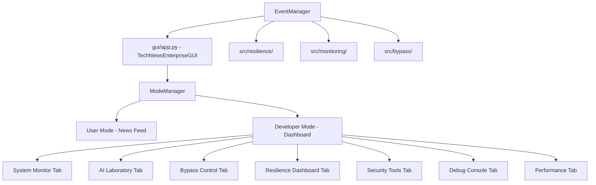

# Enterprise GUI Integration - Implementation Plan

Refactoring `gui/app.py` into a unified enterprise command center with dual-mode (User/Developer) operation.

---

## User Review Required

> [!IMPORTANT]
> **Scope:** This is a major refactor of the 4291-line `gui/app.py`. We'll preserve existing functionality while adding developer mode capabilities.

> [!WARNING]  
> **DuckDuckGo Warning:** The console still shows `RuntimeWarning: This package (duckduckgo_search) has been renamed`. The resilience system created earlier needs to be integrated into the DuckDuckGo source file to fully suppress this.

**Key Decisions:**
1. Should developer mode be password-protected (existing `SecurityManager` can handle this)?
2. Do you want the resilience system auto-initialized on GUI startup?
3. Should mode preference persist between sessions?

---

## Proposed Changes

### Component 1: Resilience Integration

First, fix the remaining DuckDuckGo warning by integrating with the resilience system.

---

#### [MODIFY] [duckduckgo_search.py](file:///Users/sci_coderamalamicia/PROJECTS/tech_news_scraper/src/sources/duckduckgo_search.py#L169)

Add warning suppression at the import/usage point:
```diff
+# Suppress duckduckgo_search deprecation warnings
+import warnings
+warnings.filterwarnings("ignore", message=".*duckduckgo_search.*")
+warnings.filterwarnings("ignore", message=".*renamed to.*ddgs.*")
```

---

### Component 2: GUI Mode Management

#### [NEW] [mode_manager.py](file:///Users/sci_coderamalamicia/PROJECTS/tech_news_scraper/gui/mode_manager.py)

New module for dual-mode switching:
- `ModeManager` class with `switch_mode()`, `save_state()`, `restore_state()`
- Mode-specific component configurations
- State preservation between switches

---

#### [NEW] [developer_dashboard.py](file:///Users/sci_coderamalamicia/PROJECTS/tech_news_scraper/gui/developer_dashboard.py)

Developer mode interface with 7 tabbed panels:
- System Monitor: Real-time metrics, component health
- AI Laboratory: Model control, training visualization
- Bypass Control: Technique selection, security research
- Resilience Dashboard: Auto-fixer status, issues treeview
- Security Tools: Fingerprint generator, behavior simulator
- Debug Console: Live logs, command execution
- Performance Analytics: CPU/memory charts, optimization tips

---

#### [MODIFY] [app.py](file:///Users/sci_coderamalamicia/PROJECTS/tech_news_scraper/gui/app.py)

Major updates to existing TechNewsGUI:

1. **Add mode toggle to header** (after ticker bar)
2. **Import resilience system** for auto-initialization
3. **Create mode-switching methods** in TechNewsGUI
4. **Add keyboard shortcuts** (Ctrl+M, F11, F12)
5. **Integrate DeveloperDashboard** as switchable panel

Key changes:
```python
# In __init__, add:
self.mode = "user"  # "user" or "developer"
self._init_resilience_system()
self._build_mode_toggle()
self._bind_keyboard_shortcuts()
```

---

### Component 3: Developer Dashboard Tabs

Each tab connects to existing backend systems:

| Tab | Backend Integration | Key Features |
|-----|---------------------|--------------|
| System Monitor | `src/monitoring/metrics_collector.py` | Live metrics, health status |
| AI Laboratory | `src/intelligence/` | Model selection, training |
| Bypass Control | `src/bypass/` | Technique toggle, test results |
| Resilience | `src/resilience/` | Auto-fixer, issues display |
| Security Tools | `src/bypass/stealth.py` | Fingerprint gen, simulation |
| Debug Console | Log handlers | Real-time logs, commands |
| Performance | `psutil` | CPU/RAM charts |

---

### Component 4: Event Integration

#### [NEW] [event_manager.py](file:///Users/sci_coderamalamicia/PROJECTS/tech_news_scraper/gui/event_manager.py)

Real-time event manager connecting backend to GUI:
- Subscribe to resilience events
- Handle metrics updates
- Show alerts for critical issues
- Update developer dashboard in real-time

---

## Architecture Diagram



---

## Implementation Order

1. **Fix DuckDuckGo warning** in `src/sources/duckduckgo_search.py`
2. **Create mode_manager.py** for mode switching logic
3. **Create developer_dashboard.py** with all 7 tabs
4. **Modify app.py** to integrate mode switching
5. **Create event_manager.py** for real-time updates
6. **Add keyboard shortcuts** and polish

---

## Verification Plan

### Automated Tests
```bash
# Run existing GUI tests (if any)
cd /Users/sci_coderamalamicia/PROJECTS/tech_news_scraper
python3 -m pytest tests/ -v -k "gui" 2>&1 | head -20

# Test imports
python3 -c "from gui.mode_manager import ModeManager; print('OK')"
python3 -c "from gui.developer_dashboard import DeveloperDashboard; print('OK')"
```

### Manual Verification

1. **Start GUI:** `python3 gui/app.py`
2. **Verify no warnings** in console (especially duckduckgo)
3. **Test mode switch:** Press Ctrl+M or F12
4. **Verify developer tabs** load without error
5. **Test resilience dashboard** shows health status
6. **Switch back to user mode:** Press F11
7. **Verify state preserved** (scroll position, etc.)

---

## Rollback Plan

The implementation is additive - existing `TechNewsGUI` remains functional:
- Mode defaults to "user" (existing behavior)
- Developer mode is opt-in via toggle
- All new files can be deleted without breaking existing code
