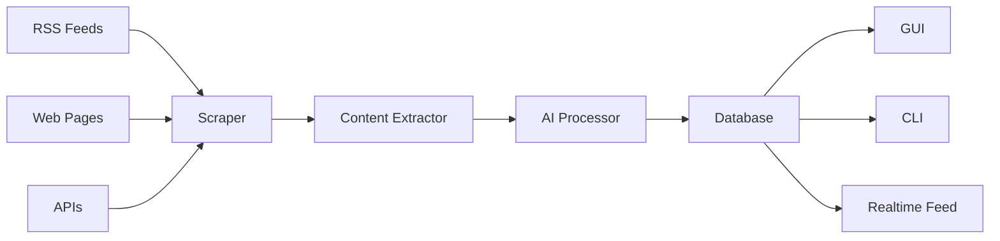
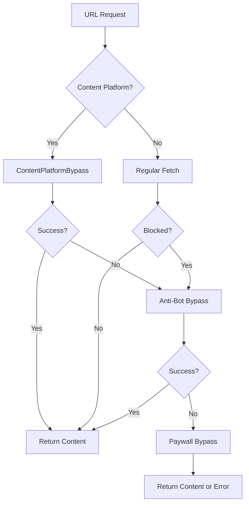
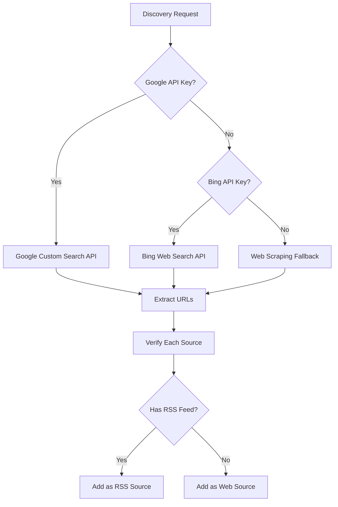
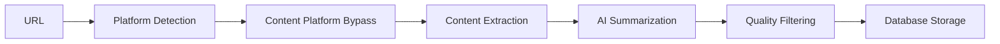

# Tech News Scraper: Complete Architecture Documentation

> **Version 2.0 | January 2026**

---

## Table of Contents

1. [Executive Summary](#1-executive-summary)
2. [System Architecture Overview](#2-system-architecture-overview)
3. [Core Modules](#3-core-modules)
4. [Bypass Module (Security Research)](#4-bypass-module-security-research)
5. [Engine Module](#5-engine-module)
6. [Data Structures](#6-data-structures)
7. [GUI Application](#7-gui-application)
8. [CLI Interface](#8-cli-interface)
9. [Configuration](#9-configuration)
10. [Database Layer](#10-database-layer)

---

## 1. Executive Summary

**Tech News Scraper** is an enterprise-grade, AI-powered news aggregation platform with advanced paywall bypass capabilities for security research. The application collects, processes, and serves tech news from 100+ sources with intelligent content extraction.

### Key Statistics

| Metric | Value |
|--------|-------|
| Total Lines of Code | ~15,000+ |
| Python Files | 45+ |
| Test Coverage | 104 tests |
| Bypass Techniques | 23 |
| Supported Platforms | Medium, Substack, Ghost, Hashnode, DEV.to |

### Technology Stack

```
┌─────────────────────────────────────────────────────────────┐
│                    PRESENTATION LAYER                       │
│  ┌─────────────┐  ┌──────────┐  ┌────────────────────────┐ │
│  │   Flet GUI  │  │  CLI/TUI │  │     REST API (Future)  │ │
│  └─────────────┘  └──────────┘  └────────────────────────┘ │
└─────────────────────────────────────────────────────────────┘
                              │
┌─────────────────────────────────────────────────────────────┐
│                    APPLICATION LAYER                        │
│  ┌─────────────┐  ┌────────────┐  ┌──────────────────────┐ │
│  │ Orchestrator│  │DeepScraper │  │  RealtimeFeeder      │ │
│  └─────────────┘  └────────────┘  └──────────────────────┘ │
└─────────────────────────────────────────────────────────────┘
                              │
┌─────────────────────────────────────────────────────────────┐
│                    BYPASS/SECURITY LAYER                    │
│  ┌────────────┐  ┌───────────┐  ┌─────────────────────────┐│
│  │ContentBypass│  │ Anti-Bot  │  │  Stealth Browser       ││
│  └────────────┘  └───────────┘  └─────────────────────────┘│
└─────────────────────────────────────────────────────────────┘
                              │
┌─────────────────────────────────────────────────────────────┐
│                    DATA LAYER                               │
│  ┌─────────────┐  ┌────────────┐  ┌──────────────────────┐ │
│  │   SQLite    │  │   Cache    │  │  Data Structures     │ │
│  └─────────────┘  └────────────┘  └──────────────────────┘ │
└─────────────────────────────────────────────────────────────┘
```

---

## 2. System Architecture Overview

### 2.1 High-Level Data Flow



### 2.2 Directory Structure

```
tech_news_scraper/
├── cli.py                    # Command-line interface (~28KB)
├── main.py                   # Entry point (~11KB)
├── requirements.txt          # Dependencies
│
├── gui/                      # Desktop GUI Application
│   ├── app.py               # Main Flet application (~135KB)
│   ├── components.py        # Reusable UI components
│   ├── theme.py             # Styling and theming
│   └── security.py          # Input validation
│
├── src/                      # Core Source Code
│   ├── scraper.py           # Main scraping logic (~35KB)
│   ├── database.py          # SQLite persistence (~17KB)
│   ├── discovery.py         # Source discovery (~35KB)
│   ├── ai_processor.py      # LLM integration (~8KB)
│   ├── content_extractor.py # HTML parsing (~8KB)
│   ├── rate_limiter.py      # Request throttling (~14KB)
│   │
│   ├── bypass/              # Security Research Module
│   │   ├── __init__.py      # Module exports
│   │   ├── anti_bot.py      # Anti-bot detection bypass
│   │   ├── browser_engine.py # Playwright automation
│   │   ├── bypass_metrics.py # Research analytics
│   │   ├── content_platform_bypass.py # Platform-specific
│   │   ├── paywall.py       # Paywall bypass
│   │   ├── proxy_engine.py  # Proxy rotation
│   │   ├── proxy_manager.py # Proxy management
│   │   └── stealth.py       # Fingerprint evasion
│   │
│   ├── engine/              # Processing Engines
│   │   ├── deep_scraper.py  # Deep content extraction
│   │   ├── orchestrator.py  # Workflow coordination
│   │   ├── query_engine.py  # Search and filtering
│   │   ├── realtime_feeder.py # Live news stream
│   │   ├── url_analyzer.py  # URL analysis
│   │   └── quality_filter.py # Content quality
│   │
│   ├── core/                # Core Types and Events
│   │   ├── events.py        # Event system
│   │   ├── exceptions.py    # Custom exceptions
│   │   ├── protocol.py      # Interfaces
│   │   └── types.py         # Type definitions
│   │
│   └── data_structures/     # Custom Data Structures
│       ├── article_queue.py # Priority article queue
│       ├── bloom_filter.py  # Duplicate detection
│       ├── lru_cache.py     # Caching layer
│       ├── priority_queue.py # Generic priority queue
│       └── trie.py          # Keyword indexing
│
├── config/                   # Configuration
│   └── settings.py          # Application settings
│
├── tests/                    # Test Suite
│   └── (13 test files)      # 104 tests total
│
└── data/                     # Data Storage
    └── tech_news.db         # SQLite database
```

---

## 3. Core Modules

### 3.1 TechNewsScraper (`src/scraper.py`)

**Lines:** 998 | **Size:** 35KB | **Methods:** 25

The main scraper class handling all content acquisition.

#### Class Structure

```python
class TechNewsScraper:
    """Main scraper with both sync and async methods."""
    
    def __init__(self, db: Database):
        self.db = db
        self.content_extractor = ContentExtractor()
        self.rate_limiter = RateLimiter()
        
        # Optional bypass handlers
        if BYPASS_AVAILABLE:
            self.anti_bot = AntiBotBypass()
            self.paywall = PaywallBypass()
            self.content_platform_bypass = ContentPlatformBypass()
```

#### Key Methods

| Method | Purpose | Async |
|--------|---------|-------|
| `scrape_rss_source_async()` | Scrape RSS feeds | ✅ |
| `scrape_web_source_async()` | Scrape web pages | ✅ |
| `_fetch_url_with_bypass_async()` | Fetch with bypass | ✅ |
| `get_full_article_and_summarize()` | Extract + AI summary | ✅ |

#### Bypass Strategy Flow



---

### 3.2 Database (`src/database.py`)

**Lines:** 466 | **Size:** 17KB | **Methods:** 19

SQLite-based persistence layer with JSON migration support.

#### Schema

```sql
CREATE TABLE articles (
    id TEXT PRIMARY KEY,
    title TEXT NOT NULL,
    url TEXT UNIQUE NOT NULL,
    source TEXT NOT NULL,
    published TEXT,
    scraped_at TEXT DEFAULT CURRENT_TIMESTAMP,
    ai_summary TEXT,
    full_content TEXT
);

CREATE TABLE discovered_sources (
    url TEXT PRIMARY KEY,
    type TEXT NOT NULL,
    name TEXT NOT NULL,
    original_url TEXT,
    verified BOOLEAN DEFAULT 1,
    discovered_at TEXT DEFAULT CURRENT_TIMESTAMP,
    quality_score REAL DEFAULT 0.5,
    article_count INTEGER DEFAULT 0
);
```

#### Key Features

- **Automatic migration** from JSON to SQLite
- **URL deduplication** via UNIQUE constraint
- **Full-text search** on title/content
- **Thread-safe** connection handling

---

### 3.3 WebDiscoveryAgent (`src/discovery.py`)

**Lines:** 1033 | **Size:** 35KB | **Methods:** 22

Intelligent source discovery with multi-tier fallback.

#### Discovery Strategy



---

### 3.4 ContentExtractor (`src/content_extractor.py`)

**Lines:** ~200 | **Size:** 8KB

Extracts clean article text from HTML using multiple strategies.

#### Extraction Strategy Order

1. **JSON-LD** (`application/ld+json`) - Most reliable
2. **Open Graph** (`og:description`) - Fallback
3. **Article tags** (`<article>`, `class="content"`)
4. **BeautifulSoup** heuristics - Last resort

---

### 3.5 AI Processor (`src/ai_processor.py`)

**Lines:** ~200 | **Size:** 8KB

Integrates with LLMs for article summarization.

```python
async def summarize_text(text: str, max_length: int = 300) -> str:
    """Generate AI summary using configured LLM."""
    # Uses GEMINI_API_KEY from environment
    # Falls back to extractive summarization
```

---

## 4. Bypass Module (Security Research)

### 4.1 Module Overview

| File | Lines | Purpose |
|------|-------|---------|
| `__init__.py` | 95 | Module exports |
| `browser_engine.py` | 1028 | Playwright automation |
| `content_platform_bypass.py` | 946 | Platform-specific bypass |
| `anti_bot.py` | 620 | Cloudflare/Imperva bypass |
| `paywall.py` | 746 | Paywall removal |
| `stealth.py` | 565 | Fingerprint evasion |
| `proxy_engine.py` | 650 | Proxy rotation |
| `bypass_metrics.py` | 425 | Research analytics |

### 4.2 StealthBrowser (`browser_engine.py`)

Playwright-based browser automation with 16+ stealth patches.

#### Stealth Features

| Feature | Implementation |
|---------|---------------|
| `navigator.webdriver` | Property deletion |
| Plugins array | Fake Chrome plugins |
| Languages | Randomized |
| WebGL fingerprint | Spoofed vendor/renderer |
| Canvas fingerprint | Subtle noise injection |
| Media codecs | Chrome codec support |
| Chrome runtime | `window.chrome` injection |

#### New Research Methods

```python
class StealthBrowser:
    async def _clear_metered_storage(page)      # Cookie manipulation
    async def _install_mutation_observer_defense(page)  # Counter re-injection
    async def _block_paywall_scripts(page)      # Script blocking
    async def _comprehensive_css_scrub(page)    # CSS property removal
    async def full_bypass_suite(url)            # All techniques combined
```

### 4.3 ContentPlatformBypass (`content_platform_bypass.py`)

Platform-specific handlers for content sites.

#### Supported Platforms

| Platform | Detection | Primary Technique |
|----------|-----------|-------------------|
| Medium | `medium.com`, `@username` | Googlebot + DOM Eraser |
| Substack | `*.substack.com` | Archive fallback |
| Ghost | `ghost-` meta tags | Playwright injection |
| Hashnode | `hashnode.dev` | JSON-LD extraction |
| DEV.to | `dev.to` | Direct fetch (no paywall) |

### 4.4 BypassMetrics (`bypass_metrics.py`)

Research analytics tracking 23 bypass techniques.

```python
from src.bypass import get_metrics, BypassTechnique

metrics = get_metrics()
metrics.record_attempt(
    technique=BypassTechnique.NEURAL_DOM_ERASER,
    platform="medium",
    url="https://medium.com/...",
    success=True,
    duration_ms=2500
)

# Export for research paper
metrics.export_to_json("data/bypass_research.json")
```

---

## 5. Engine Module

### 5.1 DeepScraper (`engine/deep_scraper.py`)

**Lines:** ~1000 | **Size:** 38KB

Deep content extraction with bypass integration.



### 5.2 TechNewsOrchestrator (`engine/orchestrator.py`)

**Lines:** ~700 | **Size:** 27KB

Coordinates all scraping workflows.

#### Orchestration Modes

| Mode | Description |
|------|-------------|
| `full_scrape` | All sources, all articles |
| `incremental` | New articles only |
| `discovery` | Find new sources |
| `realtime` | Continuous feed |

### 5.3 QueryEngine (`engine/query_engine.py`)

**Lines:** ~500 | **Size:** 19KB

Advanced search and filtering.

```python
engine = QueryEngine(db)

# Natural language query
results = await engine.search("latest AI news about GPT")

# Structured query
results = await engine.filter(
    source="techcrunch",
    date_from="2026-01-01",
    keywords=["startup", "funding"]
)
```

### 5.4 RealtimeFeeder (`engine/realtime_feeder.py`)

**Lines:** ~700 | **Size:** 27KB

Live news streaming with WebSocket support.

---

## 6. Data Structures

### 6.1 ArticleQueue (`data_structures/article_queue.py`)

**Lines:** ~400 | **Size:** 15KB

Priority queue for article processing with:
- Time-based priority decay
- Source reputation weighting
- Duplicate prevention via Bloom filter

### 6.2 BloomFilter (`data_structures/bloom_filter.py`)

**Lines:** ~300 | **Size:** 11KB

Probabilistic set for URL deduplication.

```python
from src.data_structures import BloomFilter

bf = BloomFilter(expected_items=100000, fp_rate=0.01)
bf.add("https://example.com/article-1")
bf.contains("https://example.com/article-1")  # True (definitely seen)
bf.contains("https://example.com/article-2")  # False (probably not seen)
```

### 6.3 LRUCache (`data_structures/lru_cache.py`)

**Lines:** ~300 | **Size:** 11KB

Thread-safe LRU cache with TTL support.

### 6.4 Trie (`data_structures/trie.py`)

**Lines:** ~350 | **Size:** 14KB

Prefix tree for keyword indexing and autocomplete.

---

## 7. GUI Application

### 7.1 Overview

**File:** `gui/app.py` | **Lines:** ~3500 | **Size:** 135KB

Full-featured desktop application built with Flet.

### 7.2 Key Components

| Component | Purpose |
|-----------|---------|
| `TechNewsApp` | Main application class |
| `ArticleListView` | Article grid/list display |
| `ArticleDetailView` | Full article reader |
| `URLAnalysisPopup` | URL analysis with bypass |
| `SettingsPanel` | Configuration UI |
| `RealtimeFeedView` | Live news stream |

### 7.3 Feature Highlights

- **Dark/Light theme** with glassmorphism
- **Real-time updates** via event system
- **URL analysis** with bypass status
- **AI summaries** on demand
- **Export to JSON/CSV**

---

## 8. CLI Interface

**File:** `cli.py` | **Lines:** ~800 | **Size:** 28KB

Interactive TUI with Rich-based rendering.

### Commands

```bash
python cli.py scrape        # Run scraping
python cli.py discover      # Find new sources
python cli.py search "AI"   # Search articles
python cli.py stats         # Show statistics
python cli.py export        # Export data
```

---

## 9. Configuration

**File:** `config/settings.py`

### Key Settings

| Setting | Default | Description |
|---------|---------|-------------|
| `MAX_CONCURRENT_REQUESTS` | 10 | Parallel connections |
| `REQUEST_TIMEOUT` | 15s | HTTP timeout |
| `RATE_LIMIT_DELAY` | 1s | Between requests |
| `USE_BROWSER_AUTOMATION` | True | Enable Playwright |
| `BYPASS_ENABLED` | True | Enable bypass module |

---

## 10. Database Layer

### 10.1 SQLite Schema

```sql
-- Articles table
CREATE TABLE articles (
    id TEXT PRIMARY KEY,
    title TEXT NOT NULL,
    url TEXT UNIQUE NOT NULL,
    source TEXT NOT NULL,
    published TEXT,
    scraped_at TEXT,
    ai_summary TEXT,
    full_content TEXT
);

-- Sources table
CREATE TABLE discovered_sources (
    url TEXT PRIMARY KEY,
    type TEXT NOT NULL,
    name TEXT NOT NULL,
    original_url TEXT,
    verified BOOLEAN,
    discovered_at TEXT,
    quality_score REAL,
    article_count INTEGER
);

-- Indexes for performance
CREATE INDEX idx_articles_source ON articles(source);
CREATE INDEX idx_articles_published ON articles(published);
CREATE INDEX idx_sources_type ON discovered_sources(type);
```

### 10.2 Statistics

| Table | Typical Size |
|-------|-------------|
| articles | 10,000+ rows |
| sources | 100+ rows |

---

## Appendix: File Size Summary

| Module | Files | Total Size |
|--------|-------|------------|
| gui/ | 5 | 150KB |
| src/bypass/ | 9 | 190KB |
| src/engine/ | 7 | 135KB |
| src/core/ | 5 | 31KB |
| src/data_structures/ | 6 | 63KB |
| src/ (root) | 7 | 103KB |
| **Total** | **39** | **~672KB** |

---

*Documentation generated January 2026*
