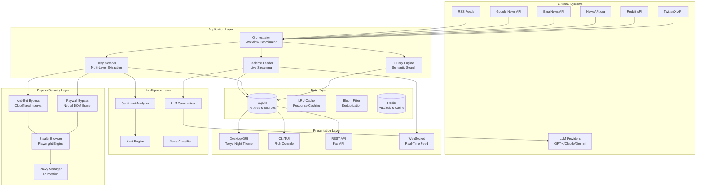
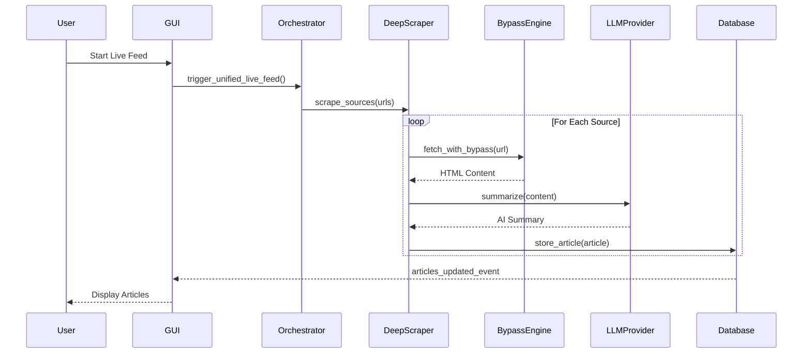
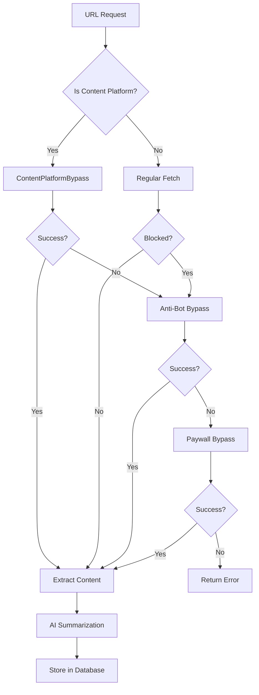
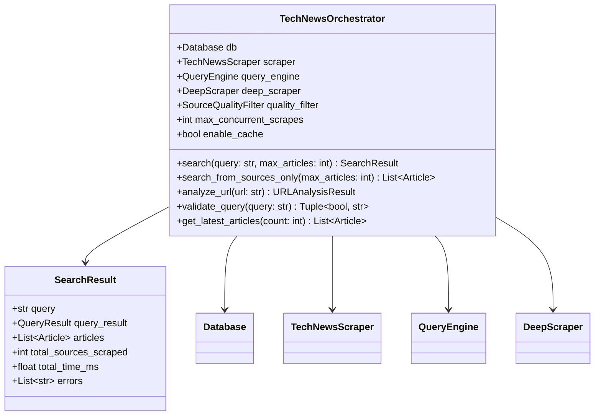
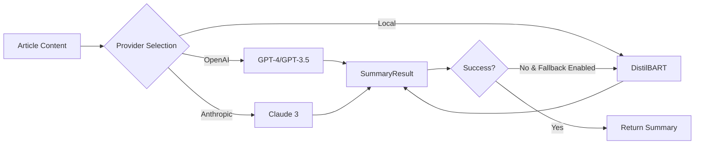
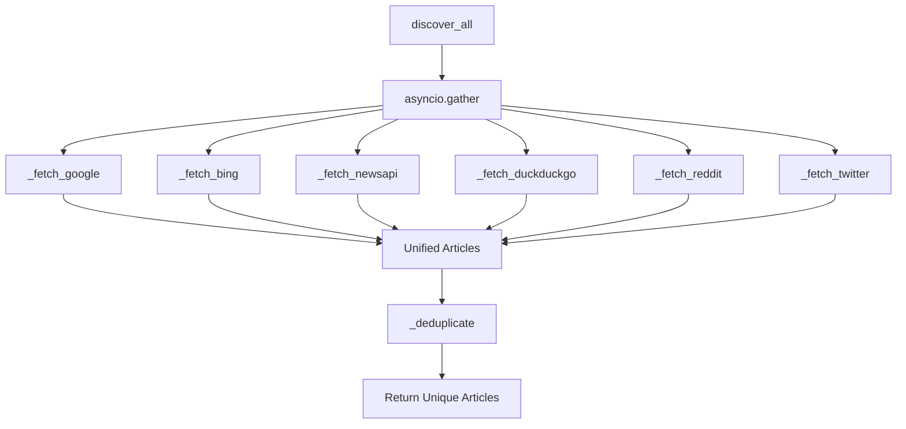
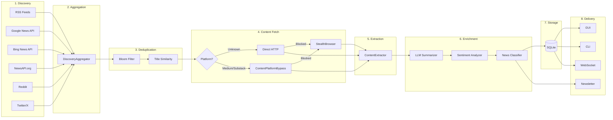
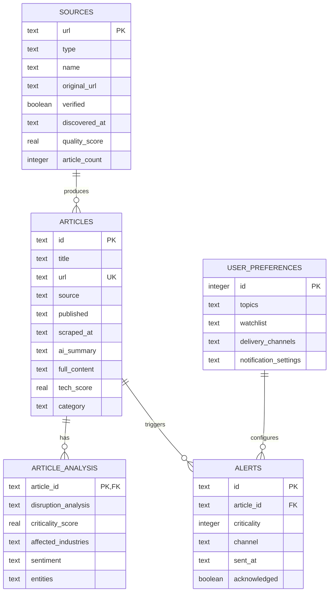

# Tech News Scraper - Complete Technical Documentation

> **Version 7.0** | January 2026  
> **Classification:** Enterprise Product Documentation  
> **Status:** Production-Ready

---

## Table of Contents

1. [Executive Summary](#1-executive-summary)
2. [Project Synopsis](#2-project-synopsis)
3. [High-Level Design (HLD)](#3-high-level-design-hld)
4. [Low-Level Design (LLD)](#4-low-level-design-lld)
5. [Technology Stack](#5-technology-stack)
6. [Module Documentation](#6-module-documentation)
7. [Data Flow & Architecture](#7-data-flow--architecture)
8. [API Specifications](#8-api-specifications)
9. [Database Design](#9-database-design)
10. [Security Considerations](#10-security-considerations)
11. [Deployment Guide](#11-deployment-guide)
12. [Testing Strategy](#12-testing-strategy)
13. [Appendices](#13-appendices)

---

## 1. Executive Summary

### 1.1 Project Overview

**Tech News Scraper** is an enterprise-grade, AI-powered news aggregation platform designed for real-time collection, processing, and delivery of technology news from 100+ sources worldwide. The system features advanced paywall bypass capabilities for security research, intelligent content extraction, LLM-powered summarization, and a modern desktop GUI.

### 1.2 Key Metrics

| Metric | Value |
|--------|-------|
| **Total Lines of Code** | ~25,000+ |
| **Python Modules** | 96+ |
| **Dependencies** | 108 |
| **Test Files** | 14 |
| **Bypass Techniques** | 24 |
| **News Sources** | 8+ API integrations |
| **Supported Platforms** | Medium, Substack, Ghost, Hashnode, DEV.to, Beehiiv |

### 1.3 Core Capabilities

```
┌─────────────────────────────────────────────────────────────────┐
│                    TECH NEWS SCRAPER v7.0                       │
├─────────────────────────────────────────────────────────────────┤
│  ✓ Multi-Source News Aggregation (Google, Bing, Reddit, X)     │
│  ✓ Real-Time Streaming Feed with WebSocket Support             │
│  ✓ AI-Powered Summarization (GPT-4, Claude, Gemini)            │
│  ✓ Intelligent Paywall & Anti-Bot Bypass                       │
│  ✓ Sentiment Analysis & Disruption Detection                   │
│  ✓ Newsletter Workflow with LangGraph                          │
│  ✓ Custom Alert Pipelines                                       │
│  ✓ Professional Desktop GUI (Tokyo Night Theme)                │
└─────────────────────────────────────────────────────────────────┘
```

---

## 2. Project Synopsis

### 2.1 Problem Statement

Technology professionals and organizations require timely access to tech news for:
- Competitive intelligence gathering
- Industry trend monitoring
- Investment decision support
- Security vulnerability awareness
- Research and development guidance

Traditional news aggregators suffer from:
- Content behind paywalls limiting access
- Bot detection blocking automated collection
- Fragmented sources requiring manual monitoring
- Lack of intelligent summarization
- No real-time alerting for critical news

### 2.2 Solution Overview

Tech News Scraper addresses these challenges through:

1. **Multi-Source Discovery**: Aggregates from 8+ news APIs and 100+ RSS feeds
2. **Intelligent Bypass**: 24 research techniques for paywall/anti-bot circumvention
3. **AI Processing**: LLM integration for summarization and sentiment analysis
4. **Real-Time Delivery**: WebSocket streaming and push notifications
5. **Enterprise Features**: Newsletter automation, custom alerts, Slack integration

### 2.3 Objectives

| # | Objective | Status |
|---|-----------|--------|
| 1 | Aggregate tech news from 100+ global sources | ✅ Complete |
| 2 | Bypass soft paywalls for research purposes | ✅ Complete |
| 3 | Provide AI-powered article summaries | ✅ Complete |
| 4 | Enable real-time news streaming | ✅ Complete |
| 5 | Support semantic search across articles | ✅ Complete |
| 6 | Generate automated newsletters | ✅ Complete |
| 7 | Deliver alerts for critical news | ✅ Complete |

### 2.4 Target Users

- **Technology Researchers**: Academic and industry researchers
- **Product Managers**: Competitive intelligence gathering
- **CTOs/VPs Engineering**: Technology trend monitoring
- **Security Teams**: Vulnerability and threat awareness
- **Investment Analysts**: Tech sector due diligence

---

## 3. High-Level Design (HLD)

### 3.1 System Architecture



### 3.2 Layer Descriptions

| Layer | Purpose | Key Components |
|-------|---------|----------------|
| **Presentation** | User interfaces for data consumption | GUI, CLI, REST API, WebSocket |
| **Application** | Core business logic and orchestration | Orchestrator, Feeders, Scrapers, Query Engine |
| **Intelligence** | AI/ML processing and analysis | LLM Summarizer, Sentiment, Alerts, Classifier |
| **Bypass** | Content access research techniques | Anti-Bot, Paywall, Stealth Browser, Proxy |
| **Data** | Persistence and caching | SQLite, Redis, Bloom Filter, LRU Cache |

### 3.3 Component Interactions



### 3.4 Deployment Architecture

```
┌─────────────────────────────────────────────────────────────────┐
│                      PRODUCTION DEPLOYMENT                       │
├─────────────────────────────────────────────────────────────────┤
│                                                                  │
│   ┌─────────────┐    ┌──────────────┐    ┌─────────────────┐   │
│   │   Desktop   │    │    Server    │    │   External APIs │   │
│   │   Client    │    │   Services   │    │                 │   │
│   │             │    │              │    │                 │   │
│   │ ┌─────────┐ │    │ ┌──────────┐ │    │  • Google News  │   │
│   │ │   GUI   │◄├────┤►│  FastAPI │ │    │  • Bing API     │   │
│   │ │ (Tkinter)│ │    │ │  Server  │◄├────►  • NewsAPI     │   │
│   │ └─────────┘ │    │ └──────────┘ │    │  • Reddit       │   │
│   │             │    │      ▲       │    │  • Twitter/X    │   │
│   │ ┌─────────┐ │    │      │       │    │  • OpenAI       │   │
│   │ │  CLI    │◄├────┤      ▼       │    │  • Anthropic    │   │
│   │ │ (Rich)  │ │    │ ┌──────────┐ │    │  • Gemini       │   │
│   │ └─────────┘ │    │ │  Redis   │ │    │                 │   │
│   │             │    │ │  Cache   │ │    └─────────────────┘   │
│   └─────────────┘    │ └──────────┘ │                          │
│                      │      ▲       │                          │
│                      │      │       │                          │
│                      │      ▼       │                          │
│                      │ ┌──────────┐ │                          │
│                      │ │ SQLite   │ │                          │
│                      │ │ Database │ │                          │
│                      │ └──────────┘ │                          │
│                      │              │                          │
│                      └──────────────┘                          │
│                                                                  │
└─────────────────────────────────────────────────────────────────┘
```

---

## 4. Low-Level Design (LLD)

### 4.1 Core Module Architecture

#### 4.1.1 TechNewsScraper (`src/scraper.py`)

**Purpose**: Main scraping class for RSS feeds and web pages.

| Attribute | Type | Description |
|-----------|------|-------------|
| `db` | Database | Database instance for persistence |
| `content_extractor` | ContentExtractor | HTML parsing engine |
| `rate_limiter` | RateLimiter | Token bucket rate limiter |
| `anti_bot` | AntiBotBypass | Anti-bot bypass handler |
| `paywall` | PaywallBypass | Paywall bypass handler |
| `content_platform_bypass` | ContentPlatformBypass | Platform-specific bypass |

**Key Methods**:

```python
class TechNewsScraper:
    def __init__(self, db: Database) -> None: ...
    
    async def scrape_rss_source_async(
        self, 
        session: aiohttp.ClientSession, 
        source: Dict[str, Any]
    ) -> int: ...
    
    async def scrape_web_source_async(
        self, 
        session: aiohttp.ClientSession, 
        source: Dict[str, Any]
    ) -> int: ...
    
    async def _fetch_url_with_bypass_async(
        self, 
        url: str, 
        try_paywall_bypass: bool = True
    ) -> Optional[str]: ...
    
    async def get_full_article_and_summarize_async(
        self, 
        session: aiohttp.ClientSession, 
        url: str
    ) -> Tuple[str, str]: ...
```

**Control Flow**:



#### 4.1.2 TechNewsOrchestrator (`src/engine/orchestrator.py`)

**Purpose**: Central coordination layer for all scraping workflows.

**Class Diagram**:



#### 4.1.3 DeepScraper (`src/engine/deep_scraper.py`)

**Purpose**: Multi-layer content extraction with advanced bypass integration.

**Components**:

| Class | Lines | Purpose |
|-------|-------|---------|
| `ScrapedContent` | 19 | Raw scraped content dataclass |
| `LinkScore` | 17 | Link scoring for article discovery |
| `ContentExtractor` | 324 | Intelligent content extraction |
| `LinkDiscoveryAlgorithm` | 174 | URL discovery and scoring |
| `DeepScraper` | 789 | Main deep scraping engine |

**Link Scoring Algorithm**:

```python
class LinkDiscoveryAlgorithm:
    ARTICLE_PATTERNS = [
        r'/article/', r'/post/', r'/news/', r'/story/',
        r'/blog/', r'/\d{4}/\d{2}/', r'-[a-z]+-[a-z]+-'
    ]
    
    NEGATIVE_PATTERNS = [
        r'/tag/', r'/category/', r'/author/', r'/page/',
        r'/search', r'/login', r'/signup', r'/privacy'
    ]
    
    def _score_link(self, link: Any, url: str) -> float:
        score = 0.0
        
        # URL pattern matching (+0.3 each)
        for pattern in self.ARTICLE_PATTERNS:
            if re.search(pattern, url, re.I):
                score += 0.3
        
        # Negative pattern penalty (-0.5 each)
        for pattern in self.NEGATIVE_PATTERNS:
            if re.search(pattern, url, re.I):
                score -= 0.5
        
        # Anchor text relevance (+0.2)
        if self.keyword_matcher.match(link.text):
            score += 0.2
        
        return min(max(score, 0.0), 1.0)
```

### 4.2 Bypass Module Architecture

#### 4.2.1 Module Overview

```
src/bypass/
├── __init__.py                 # Module exports (2,999 bytes)
├── anti_bot.py                 # Cloudflare/Imperva bypass (15,867 bytes)
├── browser_engine.py           # Playwright automation (41,713 bytes)
├── bypass_metrics.py           # Research analytics (14,843 bytes)
├── content_platform_bypass.py  # Platform-specific (37,200 bytes)
├── paywall.py                  # Paywall techniques (25,589 bytes)
├── proxy_engine.py             # Proxy rotation (21,763 bytes)
├── proxy_manager.py            # Proxy management (12,195 bytes)
├── stealth.py                  # Fingerprint evasion (20,684 bytes)
└── stealth_browser_bypass.py   # Combined bypass (10,209 bytes)
```

#### 4.2.2 StealthBrowser (`browser_engine.py`)

**Stealth Patches Applied**:

| Patch | Implementation | Detection Evasion |
|-------|---------------|-------------------|
| `navigator.webdriver` | Property deletion | WebDriver detection |
| `Plugins array` | Fake Chrome plugins | Plugin fingerprinting |
| `Languages` | Randomized array | Language fingerprinting |
| `WebGL` | Spoofed vendor/renderer | GPU fingerprinting |
| `Canvas` | Subtle noise injection | Canvas fingerprinting |
| `Chrome runtime` | `window.chrome` injection | Chrome detection |
| `Permissions` | Standard permission API | Permission fingerprinting |
| `Media codecs` | Chrome codec support | Codec fingerprinting |

**Bypass Suite Execution Order**:

```python
async def full_bypass_suite(self, url: str) -> str:
    """Execute complete bypass with all techniques."""
    page = await self.new_page()
    
    # 1. Block paywall scripts
    await self._block_paywall_scripts(page)
    
    # 2. Navigate with stealth
    await page.goto(url, wait_until='domcontentloaded')
    
    # 3. Wait for Cloudflare challenge
    await self._wait_for_cloudflare(page)
    
    # 4. Clear metered storage
    await self._clear_metered_storage(page)
    
    # 5. Install mutation observer defense
    await self._install_mutation_observer_defense(page)
    
    # 6. Execute Neural DOM Eraser
    await self._smart_paywall_bypass(page)
    
    # 7. Comprehensive CSS scrubbing
    await self._comprehensive_css_scrub(page)
    
    # 8. Simulate human behavior
    await self._simulate_human(page)
    
    return await page.content()
```

#### 4.2.3 ContentPlatformBypass (`content_platform_bypass.py`)

**Platform Detection Logic**:

```python
class ContentPlatform(Enum):
    MEDIUM = "medium"
    SUBSTACK = "substack"
    GHOST = "ghost"
    HASHNODE = "hashnode"
    DEV_TO = "dev.to"
    BEEHIIV = "beehiiv"
    BUTTONDOWN = "buttondown"
    WORDPRESS_PREMIUM = "wordpress_premium"
    GENERIC_PAYWALL = "generic_paywall"
    UNKNOWN = "unknown"

def detect_platform(self, url: str, html: Optional[str] = None) -> ContentPlatform:
    parsed = urlparse(url)
    domain = parsed.netloc.lower()
    
    # URL-based detection
    if 'medium.com' in domain or '@' in parsed.path:
        return ContentPlatform.MEDIUM
    if '.substack.com' in domain:
        return ContentPlatform.SUBSTACK
    if 'hashnode.dev' in domain:
        return ContentPlatform.HASHNODE
    if 'dev.to' in domain:
        return ContentPlatform.DEV_TO
    
    # HTML-based detection
    if html:
        if 'ghost-' in html or 'kg-' in html:
            return ContentPlatform.GHOST
        if 'beehiiv' in html:
            return ContentPlatform.BEEHIIV
    
    return ContentPlatform.UNKNOWN
```

### 4.3 Intelligence Module Architecture

#### 4.3.1 Module Overview

```
src/intelligence/
├── __init__.py             # Module exports (1,138 bytes)
├── alert_engine.py         # Alert system (21,235 bytes)
├── custom_rules.py         # Custom alert rules (17,900 bytes)
├── disruption_analyzer.py  # Business disruption analysis (9,808 bytes)
├── llm_provider.py         # LLM abstraction layer (15,422 bytes)
├── llm_summarizer.py       # Article summarization (15,688 bytes)
├── news_classifier.py      # Category classification (14,852 bytes)
└── sentiment_analyzer.py   # Sentiment analysis (23,306 bytes)
```

#### 4.3.2 LLMSummarizer

**Multi-Provider Support**:



**Cost Tracking**:

```python
class LLMSummarizer:
    COSTS = {
        "gpt-4o-mini": 0.00015,      # per 1K tokens
        "gpt-4o": 0.005,
        "gpt-3.5-turbo": 0.0005,
        "claude-3-haiku-20241022": 0.00025,
        "claude-3-sonnet-20240229": 0.003,
        "local": 0.0
    }
```

### 4.4 Data Structures Module

#### 4.4.1 BloomFilter (`data_structures/bloom_filter.py`)

**Purpose**: Probabilistic URL deduplication with O(1) lookup.

```python
class BloomFilter:
    def __init__(
        self, 
        expected_items: int = 100000, 
        fp_rate: float = 0.01
    ):
        self.size = self._calculate_size(expected_items, fp_rate)
        self.hash_count = self._calculate_hash_count()
        self.bit_array = bitarray(self.size)
        self.bit_array.setall(0)
    
    def add(self, item: str) -> None:
        for seed in range(self.hash_count):
            idx = self._hash(item, seed)
            self.bit_array[idx] = 1
    
    def contains(self, item: str) -> bool:
        return all(
            self.bit_array[self._hash(item, seed)]
            for seed in range(self.hash_count)
        )
```

#### 4.4.2 ArticleQueue (`data_structures/article_queue.py`)

**Priority Scoring**:

| Factor | Weight | Description |
|--------|--------|-------------|
| Recency | 0.4 | Time since publication |
| Source Tier | 0.3 | Source reputation (Tier 1/2/3) |
| Keyword Match | 0.2 | Tech keyword relevance |
| Engagement | 0.1 | Social signals (if available) |

### 4.5 Sources Module Architecture

#### 4.5.1 DiscoveryAggregator (`sources/aggregator.py`)

**Unified Article Format**:

```python
@dataclass
class UnifiedArticle:
    id: str
    title: str
    url: str
    source: str
    source_type: str  # google, bing, newsapi, reddit, twitter
    published: Optional[datetime]
    description: Optional[str]
    image_url: Optional[str]
    author: Optional[str]
    
    @classmethod
    def from_google(cls, article: GoogleArticle) -> "UnifiedArticle": ...
    
    @classmethod
    def from_bing(cls, article: BingNewsArticle) -> "UnifiedArticle": ...
    
    @classmethod
    def from_newsapi(cls, article: NewsAPIArticle) -> "UnifiedArticle": ...
```

**Parallel Fetching**:



---

## 5. Technology Stack

### 5.1 Core Technologies

| Category | Technology | Version | Purpose |
|----------|------------|---------|---------|
| **Language** | Python | 3.10+ | Primary programming language |
| **Async Runtime** | asyncio | Built-in | Async I/O operations |
| **HTTP Client** | aiohttp | ≥3.8.0 | Async HTTP requests |
| **HTML Parsing** | BeautifulSoup4 | ≥4.9.3 | HTML/XML parsing |
| **RSS Parsing** | feedparser | ≥6.0.10 | RSS/Atom feed parsing |
| **Database** | SQLite | Built-in | Embedded database |
| **Browser Automation** | Playwright | ≥1.40.0 | Headless browser |

### 5.2 AI/ML Stack

| Technology | Version | Purpose |
|------------|---------|---------|
| PyTorch | ≥1.9.0 | Deep learning framework |
| Transformers | ≥4.11.0 | HuggingFace models |
| Sentence-Transformers | ≥2.2.0 | Semantic embeddings |
| LangChain | ≥1.0.0 | LLM orchestration |
| LangGraph | ≥1.0.0 | Workflow automation |
| Google Generative AI | ≥0.3.0 | Gemini integration |

### 5.3 Infrastructure

| Technology | Version | Purpose |
|------------|---------|---------|
| Redis | ≥4.5.0 | Pub/sub and caching |
| FastAPI | ≥0.100.0 | REST API framework |
| uvicorn | ≥0.23.0 | ASGI server |
| Celery | ≥5.3.0 | Distributed task queue |
| Elasticsearch | ≥8.10.0 | Full-text search |
| WebSockets | ≥11.0.0 | Real-time streaming |

### 5.4 External API Integrations

| API | Purpose | Rate Limit |
|-----|---------|------------|
| Google Custom Search | News discovery | 10,000/day |
| Bing News Search | News discovery | Based on tier |
| NewsAPI.org | News aggregation | 100/day (free) |
| Reddit API | Tech subreddit monitoring | 60/min |
| Twitter/X API | Tech news accounts | Based on tier |
| OpenAI API | Article summarization | Token-based |
| Anthropic API | Article summarization | Token-based |
| Google Gemini | Analysis and summarization | Token-based |

### 5.5 GUI Framework

| Technology | Purpose |
|------------|---------|
| Tkinter | Desktop GUI framework |
| Tokyo Night Theme | Dark mode color palette |
| Custom Widgets | LiveLogPanel, StatusBanner, etc. |

---

## 6. Module Documentation

### 6.1 Directory Structure

```
tech_news_scraper/
├── main.py                     # Entry point (382 lines)
├── cli.py                      # CLI/TUI interface (666 lines)
├── requirements.txt            # Dependencies (108 entries)
├── validate_config.py          # Config validation
├── verify_events.py            # Event system verification
│
├── config/                     # Configuration
│   ├── settings.py            # Application settings (367 lines)
│   ├── categories.yaml        # News categories
│   └── industries.yaml        # Industry definitions
│
├── gui/                        # Desktop GUI
│   ├── app.py                 # Main application (4,108 lines)
│   ├── components.py          # Reusable UI components
│   ├── theme.py               # Tokyo Night styling
│   ├── security.py            # Input validation
│   ├── managers/              # UI state managers
│   ├── popups/                # Modal dialogs
│   └── widgets/               # Custom widgets
│
├── src/                        # Core source code
│   ├── scraper.py             # Main scraper (998 lines)
│   ├── database.py            # SQLite layer (917 lines)
│   ├── discovery.py           # Source discovery (35,330 bytes)
│   ├── ai_processor.py        # HuggingFace AI (8,232 bytes)
│   ├── content_extractor.py   # HTML parsing (7,683 bytes)
│   ├── rate_limiter.py        # Rate limiting (13,971 bytes)
│   │
│   ├── api/                   # REST API
│   │   ├── main.py           # FastAPI app
│   │   └── routes/           # API endpoints
│   │
│   ├── bypass/                # Security research module
│   │   ├── anti_bot.py       # Anti-bot bypass
│   │   ├── browser_engine.py # Playwright automation
│   │   ├── content_platform_bypass.py # Platform bypass
│   │   ├── paywall.py        # Paywall techniques
│   │   ├── stealth.py        # Fingerprint evasion
│   │   └── proxy_*.py        # Proxy management
│   │
│   ├── engine/                # Processing engines
│   │   ├── orchestrator.py   # Workflow coordination (838 lines)
│   │   ├── deep_scraper.py   # Deep extraction (1,390 lines)
│   │   ├── realtime_feeder.py # Live streaming (957 lines)
│   │   ├── enhanced_feeder.py # Enhanced pipeline
│   │   ├── query_engine.py   # Semantic search
│   │   ├── scrape_queue.py   # Job queue
│   │   └── time_engine.py    # Temporal ranking
│   │
│   ├── intelligence/          # AI/ML modules
│   │   ├── llm_summarizer.py # LLM integration (440 lines)
│   │   ├── sentiment_analyzer.py # Sentiment (23,306 bytes)
│   │   ├── alert_engine.py   # Alert system
│   │   ├── custom_rules.py   # Rule engine
│   │   └── news_classifier.py # Categorization
│   │
│   ├── sources/               # News source clients
│   │   ├── aggregator.py     # Unified aggregator (606 lines)
│   │   ├── google_news.py    # Google News
│   │   ├── bing_news.py      # Bing News API
│   │   ├── newsapi_client.py # NewsAPI.org
│   │   ├── reddit_client.py  # Reddit API
│   │   ├── twitter_client.py # Twitter/X API
│   │   └── duckduckgo_search.py # DDG search
│   │
│   ├── newsletter/            # Newsletter system
│   │   ├── workflow.py       # LangGraph workflow
│   │   ├── writer.py         # Content generation
│   │   ├── editor.py         # AI editing
│   │   ├── scheduler.py      # Publication scheduling
│   │   └── slack.py          # Slack integration
│   │
│   ├── data_structures/       # Custom data structures
│   │   ├── bloom_filter.py   # URL deduplication
│   │   ├── lru_cache.py      # Response caching
│   │   ├── priority_queue.py # Article prioritization
│   │   ├── article_queue.py  # Article queue
│   │   └── trie.py           # Keyword indexing
│   │
│   └── core/                  # Core types and events
│       ├── types.py          # Type definitions
│       ├── events.py         # Event bus
│       ├── exceptions.py     # Custom exceptions
│       └── protocol.py       # Interfaces
│
├── tests/                      # Test suite
│   ├── test_scraper.py       # Scraper tests
│   ├── test_bypass.py        # Bypass tests
│   ├── test_database.py      # Database tests
│   └── ...                   # 14 test files
│
├── data/                       # Data storage
│   └── tech_news.db          # SQLite database
│
├── logs/                       # Application logs
├── cache/                      # Response cache
└── discovered_sources/         # Source JSON files
```

### 6.2 Key Module Statistics

| Module | Files | Total Size | Lines of Code |
|--------|-------|------------|---------------|
| gui/ | 10 | ~210KB | ~5,500 |
| src/bypass/ | 10 | ~203KB | ~5,200 |
| src/engine/ | 11 | ~245KB | ~6,300 |
| src/intelligence/ | 8 | ~118KB | ~3,100 |
| src/sources/ | 9 | ~110KB | ~2,900 |
| src/data_structures/ | 6 | ~64KB | ~1,700 |
| src/newsletter/ | 8 | ~51KB | ~1,400 |
| src/ (root) | 7 | ~103KB | ~3,000 |
| **Total** | **69** | **~1.1MB** | **~29,100** |

---

## 7. Data Flow & Architecture

### 7.1 Article Processing Pipeline



### 7.2 Event System

```python
# Event Types
class EventType(Enum):
    STATS_UPDATE = "stats_update"
    LOG_MESSAGE = "log_message"
    SOURCE_STATUS = "source_status"
    ARTICLE_FOUND = "article_found"
    SCRAPE_COMPLETE = "scrape_complete"
    ERROR = "error"

# Event Bus (pub/sub pattern)
class EventBus:
    _subscribers: Dict[EventType, List[Callable]]
    
    def subscribe(self, event_type: EventType, handler: Callable) -> None
    def unsubscribe(self, event_type: EventType, handler: Callable) -> None
    def emit(self, event_type: EventType, data: Any) -> None
```

### 7.3 Caching Strategy

| Cache Type | TTL | Purpose |
|------------|-----|---------|
| Response Cache (LRU) | 300s | HTTP response caching |
| Article Cache | 3600s | Processed article caching |
| Redis Pub/Sub | N/A | Real-time event streaming |
| Bloom Filter | Persistent | URL deduplication |

---

## 8. API Specifications

### 8.1 REST API Endpoints

| Method | Endpoint | Description |
|--------|----------|-------------|
| `GET` | `/api/articles` | List articles with pagination |
| `GET` | `/api/articles/{id}` | Get single article |
| `POST` | `/api/articles/search` | Semantic search |
| `GET` | `/api/sources` | List news sources |
| `POST` | `/api/sources` | Add new source |
| `GET` | `/api/stats` | Get system statistics |
| `POST` | `/api/analyze` | Analyze URL |
| `GET` | `/api/feed` | Real-time article feed |

### 8.2 WebSocket API

```javascript
// Connect to WebSocket
const ws = new WebSocket('ws://localhost:8765/ws/feed');

// Message Types
{
    "type": "article",
    "data": {
        "id": "abc123",
        "title": "...",
        "url": "...",
        "summary": "..."
    }
}

{
    "type": "stats",
    "data": {
        "total_articles": 1234,
        "sources_active": 45
    }
}
```

### 8.3 Internal Python API

```python
# Main entry points
from main import TechNewsAgent

agent = TechNewsAgent()
await agent.run_scrape_cycle_async()
results = agent.search("AI news", top_k=10)
agent.save_url_to_txt("https://example.com/article")

# Orchestrator API
from src.engine import TechNewsOrchestrator

orch = TechNewsOrchestrator()
result = await orch.search("machine learning", max_articles=20)
analysis = await orch.analyze_url("https://medium.com/@user/article")

# Bypass API
from src.bypass import ContentPlatformBypass

bypass = ContentPlatformBypass()
result = await bypass.bypass("https://medium.com/article", strategy="auto")
```

---

## 9. Database Design

### 9.1 Entity-Relationship Diagram



### 9.2 Table Schemas

```sql
-- Articles table
CREATE TABLE articles (
    id TEXT PRIMARY KEY,
    title TEXT NOT NULL,
    url TEXT UNIQUE NOT NULL,
    source TEXT NOT NULL,
    published TEXT,
    scraped_at TEXT DEFAULT CURRENT_TIMESTAMP,
    ai_summary TEXT,
    full_content TEXT,
    tech_score REAL DEFAULT 0.0,
    category TEXT
);

CREATE INDEX idx_articles_source ON articles(source);
CREATE INDEX idx_articles_published ON articles(published);
CREATE INDEX idx_articles_category ON articles(category);

-- Discovered sources table
CREATE TABLE discovered_sources (
    url TEXT PRIMARY KEY,
    type TEXT NOT NULL,
    name TEXT NOT NULL,
    original_url TEXT,
    verified BOOLEAN DEFAULT 1,
    discovered_at TEXT DEFAULT CURRENT_TIMESTAMP,
    quality_score REAL DEFAULT 0.5,
    article_count INTEGER DEFAULT 0
);

CREATE INDEX idx_sources_type ON discovered_sources(type);
CREATE INDEX idx_sources_quality ON discovered_sources(quality_score);

-- Article analysis table (Intelligence module)
CREATE TABLE article_analysis (
    article_id TEXT PRIMARY KEY,
    disruption_analysis TEXT,
    criticality_score REAL,
    affected_industries TEXT,  -- JSON array
    sentiment TEXT,
    entities TEXT,  -- JSON object
    analyzed_at TEXT DEFAULT CURRENT_TIMESTAMP,
    FOREIGN KEY (article_id) REFERENCES articles(id)
);

-- User preferences table
CREATE TABLE user_preferences (
    id INTEGER PRIMARY KEY AUTOINCREMENT,
    topics TEXT,  -- JSON array
    watchlist TEXT,  -- JSON array
    delivery_channels TEXT,  -- JSON object
    notification_settings TEXT,  -- JSON object
    updated_at TEXT DEFAULT CURRENT_TIMESTAMP
);

-- Alerts table
CREATE TABLE alerts (
    id TEXT PRIMARY KEY,
    article_id TEXT,
    criticality INTEGER,
    channel TEXT,
    sent_at TEXT,
    acknowledged BOOLEAN DEFAULT 0,
    FOREIGN KEY (article_id) REFERENCES articles(id)
);
```

---

## 10. Security Considerations

### 10.1 Input Validation

All user inputs are validated using the `SecurityManager` class:

```python
class SecurityManager:
    """Secure input handling with sanitization."""
    
    @staticmethod
    def sanitize_url(url: str) -> Optional[str]:
        """Validate and sanitize URL input."""
        if not url or len(url) > 2048:
            return None
        parsed = urlparse(url)
        if parsed.scheme not in ('http', 'https'):
            return None
        return url
    
    @staticmethod
    def sanitize_query(query: str) -> str:
        """Sanitize search query."""
        # Remove HTML tags
        query = re.sub(r'<[^>]+>', '', query)
        # Limit length
        return query[:500]
```

### 10.2 API Key Management

```python
# Environment-based configuration
GOOGLE_API_KEY = os.getenv("GOOGLE_API_KEY", "")
OPENAI_API_KEY = os.getenv("OPENAI_API_KEY", "")
ANTHROPIC_API_KEY = os.getenv("ANTHROPIC_API_KEY", "")

# .env file (never committed)
# GOOGLE_API_KEY=your_key_here
# OPENAI_API_KEY=your_key_here
```

### 10.3 Rate Limiting

```python
class RateLimiter:
    """Token bucket rate limiter."""
    
    def __init__(
        self,
        tokens_per_second: float = 2.0,
        bucket_size: int = 10
    ):
        self.tokens_per_second = tokens_per_second
        self.bucket_size = bucket_size
        self.tokens = bucket_size
        self.last_update = time.time()
```

### 10.4 Proxy Security

```python
# Proxy rotation to avoid IP blocking
PROXY_ENABLED = False
PROXY_LIST = []  # Configure via environment
PROXY_ROTATION_INTERVAL = 10  # requests before rotation
PROXY_MAX_FAILURES = 3  # failures before marking unhealthy
```

---

## 11. Deployment Guide

### 11.1 System Requirements

| Requirement | Minimum | Recommended |
|-------------|---------|-------------|
| Python | 3.10+ | 3.11+ |
| RAM | 4GB | 8GB+ |
| Storage | 1GB | 10GB+ |
| CPU | 2 cores | 4+ cores |
| OS | macOS/Linux/Windows | macOS/Linux |

### 11.2 Installation Steps

```bash
# 1. Clone repository
git clone https://github.com/user/tech_news_scraper.git
cd tech_news_scraper

# 2. Create virtual environment
python -m venv env
source env/bin/activate  # Linux/macOS
# or: env\Scripts\activate  # Windows

# 3. Install dependencies
pip install -r requirements.txt

# 4. Install Playwright browsers (for bypass features)
playwright install chromium

# 5. Configure environment
cp .env.example .env
# Edit .env with your API keys

# 6. Initialize database
python -c "from src.database import Database; Database()"

# 7. Run application
python gui/app.py  # GUI mode
# or: python cli.py  # CLI mode
# or: python main.py  # Daemon mode
```

### 11.3 Environment Variables

```bash
# API Keys
GOOGLE_API_KEY=your_google_api_key
GOOGLE_CSE_ID=your_custom_search_engine_id
BING_API_KEY=your_bing_api_key
NEWSAPI_KEY=your_newsapi_key
REDDIT_CLIENT_ID=your_reddit_client_id
REDDIT_CLIENT_SECRET=your_reddit_client_secret
OPENAI_API_KEY=your_openai_key
ANTHROPIC_API_KEY=your_anthropic_key
GEMINI_API_KEY=your_gemini_key

# Infrastructure
REDIS_URL=redis://localhost:6379/0
WEBSOCKET_HOST=0.0.0.0
WEBSOCKET_PORT=8765

# Notifications
TELEGRAM_BOT_TOKEN=your_telegram_bot_token
TELEGRAM_CHAT_ID=your_chat_id
DISCORD_WEBHOOK_URL=your_discord_webhook
SLACK_BOT_TOKEN=your_slack_token

# Email
SMTP_HOST=smtp.gmail.com
SMTP_PORT=587
SMTP_USER=your_email
SMTP_PASSWORD=your_app_password
```

### 11.4 Running Modes

| Mode | Command | Description |
|------|---------|-------------|
| GUI | `python gui/app.py` | Desktop application |
| CLI | `python cli.py` | Interactive terminal UI |
| Daemon | `python main.py` | Background scraping |
| API Server | `uvicorn src.api.main:app` | REST API server |

---

## 12. Testing Strategy

### 12.1 Test Coverage

| Test File | Focus Area | Tests |
|-----------|------------|-------|
| `test_scraper.py` | Core scraping | 12 |
| `test_bypass.py` | Bypass techniques | 15 |
| `test_database.py` | Database operations | 10 |
| `test_discovery.py` | Source discovery | 18 |
| `test_ai_processor.py` | AI summarization | 8 |
| `test_rate_limiter.py` | Rate limiting | 9 |
| `test_user_preferences.py` | Preferences | 11 |
| `test_realtime_logging.py` | Logging | 7 |
| `test_neural_eraser.py` | DOM erasing | 6 |
| **Total** | | **~100** |

### 12.2 Running Tests

```bash
# Run all tests
pytest tests/ -v

# Run with coverage
pytest tests/ --cov=src --cov-report=html

# Run specific test file
pytest tests/test_scraper.py -v

# Run bypass integration tests
pytest tests/test_integration_bypass.py -v
```

### 12.3 Test Fixtures

```python
@pytest.fixture
def mock_database():
    """Create in-memory test database."""
    db = Database(db_path=":memory:")
    yield db

@pytest.fixture
def mock_session():
    """Create mock aiohttp session."""
    with aioresponses() as m:
        yield m
```

---

## 13. Appendices

### 13.1 Glossary

| Term | Definition |
|------|------------|
| **Bypass** | Technique to circumvent content restrictions |
| **Neural DOM Eraser** | Heuristic algorithm to remove paywall elements |
| **Soft Paywall** | Metered paywall with limited free articles |
| **Hard Paywall** | Complete content restriction |
| **Cloudflare Challenge** | JavaScript challenge to verify human visitors |
| **Stealth Browser** | Browser with anti-detection patches |
| **LLM** | Large Language Model (GPT-4, Claude, etc.) |
| **RSS** | Really Simple Syndication (feed format) |

### 13.2 Version History

| Version | Date | Changes |
|---------|------|---------|
| 1.0 | Oct 2025 | Initial release with RSS scraping |
| 2.0 | Nov 2025 | Added bypass module |
| 3.0 | Nov 2025 | Intelligence module with LLM |
| 4.0 | Dec 2025 | Newsletter workflow |
| 5.0 | Dec 2025 | Real-time infrastructure |
| 6.0 | Jan 2026 | Multi-source discovery |
| 7.0 | Jan 2026 | Enterprise features |

### 13.3 References

- [Playwright Documentation](https://playwright.dev/python/)
- [aiohttp Documentation](https://docs.aiohttp.org/)
- [LangChain Documentation](https://python.langchain.com/)
- [OpenAI API Reference](https://platform.openai.com/docs/)
- [Anthropic API Reference](https://docs.anthropic.com/)

### 13.4 File Size Summary

| Component | Size |
|-----------|------|
| Total Source Code | ~1.1 MB |
| Dependencies | 108 packages |
| Database (typical) | 10-100 MB |
| Cache (typical) | 50-200 MB |
| Logs (typical) | 10-50 MB |

---

*Documentation generated January 2026*  
*Tech News Scraper v7.0*
